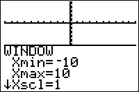

           
|Command Summary|Command Syntax|[Calculator Compatibility](compatibility.html)|[Token Size](tokens.html)|
|--- |--- |--- |--- |
|Restores window settings to the default.|ZStandard|TI-83/84/+/SE|1 byte|

### Menu Location
Press:
1. ZOOM to access the zoom menu.
1. 6 to select ZStandard, or use arrows and ENTER.
       
# The ZStandard Command

The ZStandard command resets all [window variables](system-variables.html#window) found in the Window screen to their default values. This means that, unlike the other zoom commands, ZStandard can affect variables other than Xmin, Xmax, Ymin, and Ymax. However, it will only affect variables that have a purpose in the current [graphing mode](graphing-mode.html). Here are the default values set by ZStandard:

In all modes:
- Xmin=-10
- Xmax=10
- Xscl=1
- Ymin=-10
- Ymax=10
- Yscl=1
Only in [Func](func.html) mode:
- Xres=1
Only in [Param](param.html) mode:
- Tmin=0
- Tmax=2π (in [Radian](radian-mode.html) mode) or 360 (in [Degree](degree-mode.html) mode)
- Tstep=π/24 (in Radian mode) or 7.5 (in Degree mode)
Only in [Polar](polar-mode.html) mode:
- θmin=0
- θmax=2π (in Radian mode) or 360 (in Degree mode)
- θstep=π/24 (in Radian mode) or 7.5 (in Degree mode)
Only in [Seq](seq-mode.html) mode:
- *n*Min=1
- *n*Max=10
- PlotStart=1
- PlotStep=1

These settings are often useful as a "lowest common denominator" that will work fairly well for all graphs.

## Advanced Uses

ZStandard is often used before commands such as [ZSquare](zsquare.html) or [ZInteger](zinteger.html) in programs. This serves two purposes: it makes sure that the center of the screen for ZSquare and ZInteger is (0,0), and it ensures that the graph screen is cleared without having to resort to [ClrDraw](clrdraw.html) (because with two different zooms in a row, the window settings have to change at least once, which means the graph will have to be regraphed)

## Error Conditions

- **[ERR:INVALID](errors.html#invalid)** occurs if this command is used outside a program.

## Related Commands

- [ZSquare](zsquare.html)
- [ZInteger](zinteger.html)
