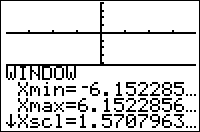

           
|Command Summary|Command Syntax|[Calculator Compatibility](compatibility.html)|[Token Size](tokens.html)|
|--- |--- |--- |--- |
|Zooms to a trigonometry-friendly window.|ZTrig|TI-83/84/+/SE|1 byte|

### Menu Location
Press:
1. ZOOM to access the zoom menu.
1. 7 to select ZTrig, or use arrows and ENTER.
       
# The ZTrig Command

The `ZTrig` command sets the screen to a special [friendly window](friendly-window.html) useful for trigonometric calculations. Unlike the [`ZDecimal`](zdecimal.html) and [`ZInteger`](zinteger.html) commands, for which the distance between two pixels is a short decimal or integer, `ZTrig` sets the horizontal distance between two pixels to be π/24 (in [`Radian`](radian-mode.html) mode) or 7.5 (in [`Degree`](degree-mode.html) mode) . The specific changes `ZTrig` makes are:
- Xmin=-352.5[°](degree-symbol.html) or -47/24π[r](radian-symbol.html)
- Xmax=352.5° or 47/24πr
- Xscl=90° or π/2r
- Ymin=-4
- Ymax=4
- Yscl=1

Although this window is not quite square (and therefore, distances in the X and Y direction are not exactly equally proportioned), it is quite close, when in `Radian` mode. In a square window (such as the output of [`ZSquare`](zsquare.html)), Ymax would have to be 31/24π, which is approximately 4.05789. As you can see, the value of 4 that `ZTrig` uses is not too far off.

## Advanced Uses

In theory, `ZTrig` should be quite useful in graphing trigonometric functions, since the calculated points would fall exactly on important angles; for example, it would graph the asymptotes of Y=[`tan(`](tan.html)X) correctly. This is actually only true when in [`Degree`](degree-mode.html) mode. In [`Radian`](radian-mode.html) mode, due to round-off error, the pixels far away from the origin do not *exactly* correspond to rational multiples of π. For example, the pixel which was supposed to correspond to π/2 actually has a value of .5000000001*π, which is enough to make this command mostly useless.

However, in [`G-T`](g-t.html) mode, the size that the graph takes up on the screen is different, and `ZTrig` uses the same values, unlike [`ZDecimal`](zdecimal.html).

## Error Conditions

- **[ERR:INVALID](errors.html#invalid)** occurs if this command is used outside a program (but not if the menu option is used, of course).

## Related Commands

- [`ZDecimal`](zdecimal.html)
- [`ZInteger`](zinteger.html)
- [`ZStandard`](zstandard.html)

## See Also

- [Friendly Graphing Windows](friendly-window.html)
