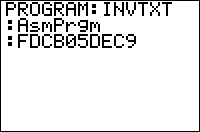

           
|Command Summary|Command Syntax|[Calculator Compatibility](compatibility.html)|[Token Size](tokens.html)|
|--- |--- |--- |--- |
|This command must be the beginning of an assembly program.|AsmPrgm|TI-83+/84+/SE/CSE/CE<br><br>(not available on the regular TI-83)|2 bytes|

### Menu Location
This command is only found in the catalog. Press:<br># 2nd CATALOG to access the command catalog.<br># Scroll down to AsmPrgm and press ENTER.
# The AsmPrgm Command

This command denotes the start of an assembly program in hexadecimal form. The command must go at the beginning of a program.

Using `AsmPrgm` is the only built-in way to create assembly programs on the calculator, and it's not very convenient. To use it, after `AsmPrgm` itself, you must type in the hexadecimal values (using the numbers 0-9, and the letters A-F) of every byte of the assembly program. Even for assembly programmers, this is a complicated process: unless you've memorized the hexadecimal value of every assembly command (which is about as easy as memorizing the hexadecimal value of every TI-Basic [token](tokens.html)) you have to look every command up in a table.

In addition, it's easy to make a typo while doing this. For this reason, it's recommended **not** to use `AsmPrgm` to write assembly programs on the calculator, but instead write assembly programs on the computer. This also lets you use emulators and debuggers and such, as opposed to crashing your calculator (possibly permanently) every time you have a bug.

Just about the only use for `AsmPrgm` is to enter the hex codes for simple assembly routines that can be called from Basic programs or used for some other short task. For example, the following program will allow you to type in lowercase letters (by pressing ALPHA twice, you go into lowercase letter mode):

```
AsmPrgmFDCB24DEC9
```

To use this, create a program, and enter the code above into it. Then run the program using [`Asm(`](asm-command.html). Voila! Lowercase letters are now enabled.

More such short programs can be found [here](hexcodes.html).

## TI-84+ Color Calculators

For the TI-84+ C series of calculators, `AsmPrgm` has been replaced by two new commands: `AsmPrgm84C` for the TI-84+ CSE and `AsmPrgmCE` for the TI-84+ CE. The commands function in the exact same manner as the original `AsmPrgm` command. However, it is important to note that sending assembly programs between a CSE and CE (or vice versa) may cause errors due to a difference in commands. 

Many of the hex codes involving `AsmPrgm` also no longer function correctly on C series calculators. The updated hex codes can be found [here](84cse:hexcodes.html). Please note, however, that directly entering hex codes has been disabled on the CE with OS 5.3.1; attempting to view `AsmPrgmCE` in the catalog will show the command crossed-out. Hex codes can be still be run from older programs.

## Related Commands

- [`Asm(`](asm-command.html)
- [`AsmComp(`](asmcomp.html)

## See Also

- [Assembly Hex Codes](hexcodes.html)
- [C Series Hex Codes](84cse:hexcodes.html)
