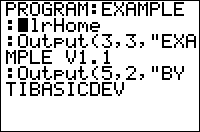

           
|Command Summary|Command Syntax|[Calculator Compatibility](compatibility.html)|[Token Size](tokens.html)|
|--- |--- |--- |--- |
|Clears the home screen of any text or numbers.|ClrHome|TI-83/84/+/SE/CSE/CE|1 byte|

### Menu Location
While editing a program, press: # PRGM to enter the PRGM menu # RIGHT to enter the I/O menu # 8 to choose ClrHome, or use arrows
# The ClrHome Command

There are numerous times in a program that you need a clear screen, so that you can display whatever text you want without it being interrupted. One place, in particular, is at the [beginning](setup.html) of a program, since the previous program call(s) and any other text is typically still displayed on the screen. The simple `ClrHome` command is the command you use to clear the home screen.

When you use the `ClrHome`, it resets the cursor position to the top left corner of the home screen. This is what the [`Disp`](disp.html) and [`Pause`](pause.html) commands use as the reference for what line to display their text on, but it does not have any effect on [`Output(`](output.html).

## Advanced Uses

You want to make sure to clear the home screen when [exiting](cleanup.html) programs (at the end of a program). This ensures that the next program that the user runs will not have to deal with whatever text your program left behind. It also helps the user, because they will not have to manually clear the home screen by pressing the CLEAR key; you have already done it for them.

## Error Conditions

- **[ERR:INVALID](errors.html#invalid)** occurs if this statement is used outside a program.

## Related Commands

- [`ClrDraw`](clrdraw.html)

## See Also

- [Program Setup](setup.html)
- [Program Cleanup](cleanup.html)
