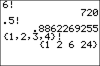

           
|Command Summary|Command Syntax|[Calculator Compatibility](compatibility.html)|[Token Size](tokens.html)|
|--- |--- |--- |--- |
|Calculates the factorial of a number or list.|*value*!|TI-83/84/+/SE|1 byte|

### Menu Location
Press:<br># MATH to access the [math](math.html) menu.<br># LEFT to access the PRB submenu.<br># 4 to select !, or use arrows.
# The ! Command

! is the factorial function, where *n*! = *n**(*n*-1)! and 0! = 1, *n* an nonnegative integer. The function also works for arguments that are half an odd integer and greater than -1/2: $(-\frac1{2})!$ is defined as $\sqrt{\pi}$ and the rest are defined recursively. 69 is the largest number for which the calculator can perform the operation. 
```
3!
     6
(‾.5)!
     1.772453851
Ans²
     3.141592654
```

The combinatorial interpretation of factorials is the number of ways to arrange *n* objects in order.

## Error Conditions

- **[ERR:DOMAIN](errors.html#domain)** for any numbers except the ones mentioned above.
 
## Related Commands

- [nPr](npr.html)
- [nCr](ncr.html)
