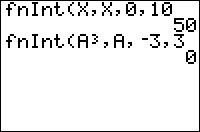

           
|Command Summary|Command Syntax|[Calculator Compatibility](compatibility.html)|[Token Size](tokens.html)|
|--- |--- |--- |--- |
|Approximately computes a definite integral.|fnInt(*f*(*var*),*var*,*a*,*b*[,*tol*])|TI-83/84/+/SE|1 byte|

### Menu Location
Press<br># Press MATH to access the [math](math.html) menu.<br># 9 to select fnInt(, or use arrows.
# The fnInt( Command

`fnInt(*f*(*var*),*var*,*a*,*b*[,*tol*])` computes an approximation to the definite integral of *f* with respect to *var* from *a* to *b*. *tol* controls the accuracy of the integral computed. The default value of *tol* is 10<sup>-5</sup>. fnInt( returns exact results for functions that are polynomials of small degree.

`fnInt(` only works for real numbers and expressions. The [Gauss-Kronrod method](http://mathworld.wolfram.com/gauss-kronrodquadrature.html) is used for approximating the integral.

**Tip**: Sometimes, to get an answer of acceptable accuracy out of `fnInt(`, substitution of variables and analytic manipulation may be needed.
```
fnInt(1/X,X,1,2)
		.6931471806
fnInt(ln(X),X,0,1) <a difficult example>
		-.999998347
fnInt(ln(X),X,0,1,e-11)
		-1
```

## Error Conditions

- **[ERR:DOMAIN](errors.html#domain)** is thrown if *tol* is 0.
- **[ERR:ILLEGAL NEST](errors.html#illegalnest)** is thrown if `fnInt(` occurs in the expression to be integrated.
- **[ERR:TOL NOT MET](errors.html#tolnotmet)** may occur if the tolerance is too small.
 
## Related Commands

- [`fMin(`](fmin.html)
- [`fMax(`](fmax.html)
- [`nDeriv(`](nderiv.html)
