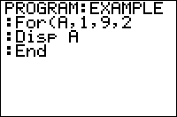

           
|Command Summary|Command Syntax|[Calculator Compatibility](compatibility.html)|[Token Size](tokens.html)|
|--- |--- |--- |--- |
|Executes some commands many times, with a variable increasing from *start* to *end* by *step*, with the default value *step*=1.|For(*variable*,*start*,*end*[,*step*])<br>*statement(s)*<br>End|TI-83/84/+/SE|1 byte|

### Menu Location
While editing a program press:<br># PRGM to enter the PRGM menu<br># 4 to choose For(, or use arrows<br># 7 to choose End, or use arrows
# The For( Command

A `For(` loop is generally used to do something a specific number of times or to go through each one of a bunch of things (such as elements of a list, or the pixels of your screen). Of all the loops, it's the most complicated. The syntax:

```
For(variable,start,end[,step]
statement(s)
End
```

What the loop does:
1. Stores *start* to *variable*.
1. If *variable* is greater than *end* (or less than, if *step* is negative), then the `For(` loop ends immediately.
1. Runs the statement(s).
1. Adds *step* to *variable* and returns to Step 2.

If no value for *step* is given, *step* is assumed to be 1.

In other words: **a `For(` loop repeats its contents once for every value of *variable* between *start* and *end***.

This is perhaps best explained with an example. The following code will display the numbers 1 to 10, in order:

```:For(A,1,10)
:Disp A
:End
```

Now, all of this could be done with a [`Repeat`](repeat.html) or [`While`](while.html) command and some manipulation, except that this is faster because it's a single command. Still, why have a separate command for something that seems so specific and arbitrary? Well, it's because `For(` has so many uses!

- Do something to each element of a list, matrix, or string.
- Draw several similar objects on the graph screen.
- Create [animations](animation.html).
- Easily add the possibility of levels to many games.
- Any number of other things...

An advanced note: each time the program enters a `For(` loop, the calculator uses 43 bytes of memory to keep track of this. This memory is given back to you as soon as the program reaches `End`. This isn't really a problem unless you're low on RAM, or have a lot of nested `For(` statements. However, if you use [`Goto`](goto.html) to jump out of a `For(` loop, you lose those bytes for as long as the program is running—and if you keep doing this, you might easily run out of memory, resulting in [ERR:MEMORY](errors.html#memory).

## Advanced Uses

Sometimes you want to exit out of a `For(` loop when it hasn't finished. You can do this by storing the *end* value to the variable you used in the `For(` loop. For example:

```:For(A,1,100)
<some code>
:If <condition for exiting out>
:100→A
:End
```

------

`For(` can also be used to create a delay:
```
//delays for about 0.5 second (83+) or 0.2 second (83+SE/84+/SE/CSE)
:For(A,1,200)
:End
```
If X is *end*, the delay will be about X/1000 seconds for the TI-83/83+, and X/400 for other calculators.

Unlike delays that use [`rand`](rand.html), a `For(` loop delay can execute an animation or other code during the delay.

------

`For(` loops can be nested to execute code once for every combination of values of several variables. For example:
```
:For(A,1,50)
:For(B,1,50)
:(some code)
:End
:End
```
This will run (some code) 2500 times—once for every combination of a value of A from 1 to 50 and a value of B from 1 to 50.

There's a standard way to exclude repetitions if the order of the variables doesn't matter (for example, if A=30, B=40 is the same situation as A=40, B=30 in the example above). In this case, the beginning of the loop should be changed to:
```
:For(A,1,50)
:For(B,1,A)
```

------

On the CSE, a list index can be used as the variable in a `For(` loop. When this is done, the loop will operate and exit normally, but the list will not be affected. For instance, this program
```
:{1,2,3→L₁
:For(L₁(1),2,5
:Disp "X
:End
:Disp L₁
```
will output:
```
X
X
X
X
  {1,2,3}
```

------

`For(` loops can also be used to exceed the normal [overflow](errors.html#overflow) limit of $10^{100}$ for variables and computations. For example, utilizing the optional *step* argument,

```
:For(A,9E99,9E99,9E99
:End
```

the value of A will be `1.8E100`, which is otherwise impossible to assign to a variable by normal means. One could then use A as the step value for a `For(` command,

```
:For(A,A,A,A
:End
```

which doubles the value of A (so `1.8E100` becomes `3.6E100`). This process can be repeated until the "true" overflow limit is reached at $10^{128}$ (since the calculator stores the exponent as a signed 8-bit integer, ranging from -128 to 127).

## Optimization

The [`seq(`](seq-list.html) command, or simple math, can often be used in place of the `For(` command when dealing with lists. For example:

```:For(A,1,dim(L1
:cos(A)→L1(A
:End
//can be
:seq(cos(A),A,1,dim(L1→L1
```

and 

```:For(A,1,dim(L1
:1+L1(A→L1(A
:End
//can be
:1+L1→L1
```

One rather strange optimization when using `For(` loops is actually leaving on the ending parenthesis of the `For(` loop in certain cases. If you don't do this, the following cases will be processed **much** slower when they are the <u>first</u> line of code in the loop:
- [`IS>(`](is-.html) and [`DS<(`](ds-.html) (no matter if the following command is skipped or not).
- A lone [`If`](if.html) without an accompanying `Then`, but **only** when the condition is false (`If` with a true condition is unchanged).

If the condition of the [`If`](if.html) command can be false (as in most actual cases), you should add a closing parenthesis because the difference is so great.

An example use of this optimization:
```
:For(I,1,1200
:If 0
:1
:End

//should be
:For(I,1,1200)
:If 0
:1
:End
```

## Command Timings

Using a `For(` loop when it fits your purpose is much faster than adapting a `While` or `Repeat` loop to do so. Conclusion: `For(` loops are good!

## Error Conditions

- **[ERR:INCREMENT](errors.html#increment)** is thrown if the increment of the `For(` loop is 0.
- **[ERR:INVALID](errors.html#invalid)** occurs if this statement is used outside a program.
- **[ERR:UNDEFINED](errors.html#undefined)** is thrown if you `DelVar` the loop variable while inside the loop.

## Related Commands

- [`Repeat`](repeat.html)
- [`While`](while.html)
- [`If`](if.html)
