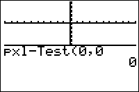

           
|Command Summary|Command Syntax|[Calculator Compatibility](compatibility.html)|[Token Size](tokens.html)|
|--- |--- |--- |--- |
|Tests a pixel on the graph screen to see if it is on or off.|pxl-Test(Y,X)|TI-83/84/+/SE|1 byte|

### Menu Location
While editing a program press:<br># 2nd PRGM to enter the DRAW menu<br># RIGHT to enter the POINTS menu<br># 7 to choose pxl-Test(, or use arrows
# The pxl-Test( Command

The pxl-Test( command is used to test a pixel at the given (Y,X) coordinates of the graph screen, to see whether it is on or off. One is returned if the pixel is on and zero is returned if the pixel is off. Please note that the coordinates are switched around so that the row comes first and then the column — it's (Y,X) instead of (X,Y). This command's coordinates are independent of the window settings.

You can store the result of pxl-Test( to a variable for later use, or use the command in a [conditional](if.html) or [loop](controlflow.html).

```
:Pxl-On(25,25
:If pxl-Test(25,25
:Disp "Pixel turned on!
```

## Error Conditions

- **[ERR:DOMAIN](errors.html#domain)** is triggered if the coordinates are not whole numbers or not in the right range ([0..62] for row, [0..94] for column). These bounds are also affected by split screen mode ([Horiz](http://tibasicdev.github.io/horiz))

## Related Commands

- [Pxl-On(](pxl-on.html)
- [Pxl-Off(](pxl-off.html)
- [Pxl-Change(](pxl-change.html)
