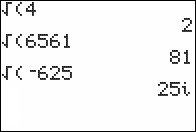

           
|Command Summary|Command Syntax|[Calculator Compatibility](compatibility.html)|[Token Size](tokens.html)|
|--- |--- |--- |--- |
|Take the square root of a number.|√(*input*)|TI-83/84/+/SE|1 byte|

### Menu Location
Press 2nd √ to paste the √( command.
# The √( Command

Takes the square root of a positive or negative number.  It works exactly the same as 2<sup>×</sup>√ or ^(1/2) but is smaller and uses an ending parenthesis.  If used on a list, it will return a list with the square root of each element.
```
√(4)
		2
√(2)
		1.414213562
		
√({1,-1})
		{1 i}
```

This may return a complex number or throw [ERR:NONREAL ANS](errors.html#nonrealans) (depending on mode settings) if taking the square root of a negative number.

## Optimization

Never raise something to the one-half power explicitly; use this command instead.

```
:X^(1/2)→X
can be
:√(X→X
```

## Error Conditions

- **[ERR:NONREAL ANS](errors.html#nonrealans)** when taking the square root of a negative number in [Real](real-mode.html) mode.

## Related Commands

- [^](power.html)
- [×√](xroot.html)
- [³√(](cube-root.html)
- [R►Pr(](r-pr.html)
