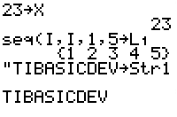

           
|Command Summary|Command Syntax|[Calculator Compatibility](compatibility.html)|[Token Size](tokens.html)|
|--- |--- |--- |--- |
|Stores a value to a variable.|*Value*→*Variable*|TI-83/84/+/SE|1 byte|

### Menu Location
Press [STO►]
# The → Command

The → (store) command will store a number, variable, or expression to a variable, using the respective value(s) of the variable(s) at the time. When storing a value in a variable, you have the value on the left side of → and the variable that it will be stored to on the right side.

```
:1→X
           1

:{1.3,5.7,9.11→ABC
           {1.3 5.7 9.11}

:"HELLO WORLD→Str1
           "HELLO WORLD"
```

## Advanced

It's not easy to put a → symbol into a string, since "→→Str1 would produce a syntax error (and in general, when the calculator 'sees' a → symbol, it assumes that the string is over, and interprets the symbol literally).

However, you can use [Equ►String(](equ-string.html) (outside a program) to get the → or " symbols in a string:

1. Type them on the home screen and press [ENTER]
1. Select 1:Quit when the **[ERR:SYNTAX](errors.html#syntax)** comes up.
1. Press [Y=] to go to the equation editor.
1. Press [2nd] [ENTRY] to recall the symbols to Y<sub>1</sub>
1. Now, use Equ►String(Y<sub>1</sub>,Str1) to store the symbols to a string.

## Optimization

You can remove closing parentheses, braces, brackets, and quotes that are before a → command.

Here are a series of examples of using the → command. The first line of each example uses more bytes than necessary. The line following strips out the unnecessary characters and uses less bytes.

++++ Real Variables

```
1/(2*(3/4))→X
1/(2(3/4→X
```

++++ Strings

```
"Hello"→Str1
"Hello→Str1
```

++++ Lists

```
{1,2,3,2(X+1)}→L₁
{1,2,3,2(X+1→L₁
```

```
5→L₁(1)
5→L₁(1
```

```
{4,5,6}→∟LISTX
{4,5,6→LISTX
```

Tip: You can remove the `∟` character when storing an entire list to a custom named list, but you must keep the `∟` character present when storing to a specific item, such as `3→∟LISTX(1`


## Related Commands

- [DelVar](delvar.html)
- [The ∟ Command](l.html) - used when referencing lists with a custom name
